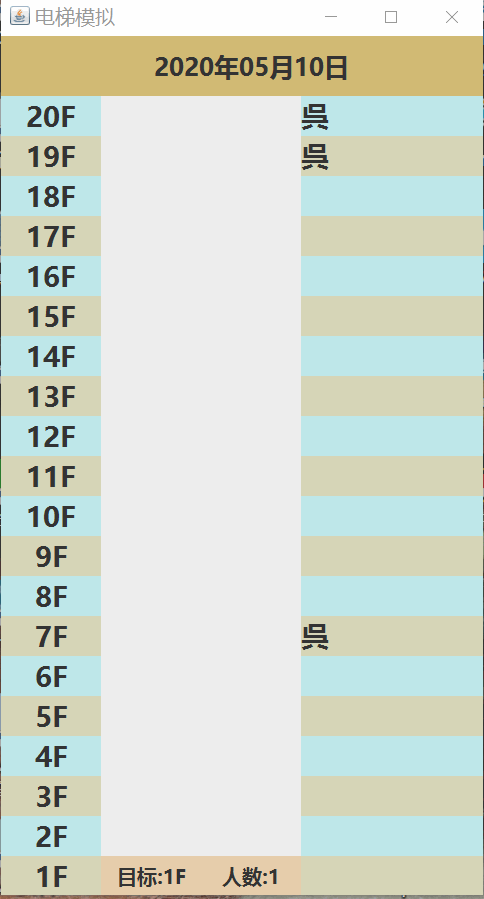

# simulate_elevator
Simulation of the elevator.   生活中电梯运行逻辑的简单模拟。

在生活中，我们日常使用的电梯是如何运行的、在行进过程中如何即时处理信息、这其中有着什么样的逻辑等等，充满了神秘感。

# 组成要素

本程序由 5 个部分组成：

## People 类，电梯的乘客对象

该类定义了一个电梯乘客的基本属性（所在楼层、目标楼层、在电梯外按下的按钮 上/下、是否已在电梯内）

在该类的构造方法中，通过给定楼层高度，随机生成一个乘客对象。

## ElevatorGUI 类，绘制电梯的图形化界面，电梯对象

在早期的版本中，GUI 使用的就是命令行界面，但显示效果不太好。由此，使用 Java 内置的 awt 和 swing 包绘制图形界面。

该类除了基本的绘制界面外，还提供了 4 个方法（moveUp, moveDown, openDoor, closeDoor）以及电梯的一些基本属性供外部调用。

## WriteMsg 类，生成乘客对象并写入消息队列

该类继承了 Thread 类，并覆写了 run 方法，每个一秒，向消息队列中写入一个乘客信息。

## ElevatorLogic 类，包含了电梯运行的主要逻辑

是整个程序中的最核心的部分，电梯究竟是如何运行的，如何即时分析信息的，都包含在这个类中。该类的代码经过精简后，大概还有 300 行。

## ElevatorStarter，电梯启动器

整个程序的入口，先实例化 具有**图形化界面**的 电梯对象，然后再实例化 **写入消息** 线程，最后再实例化 **电梯运行逻辑** 线程。

# 运行效果

